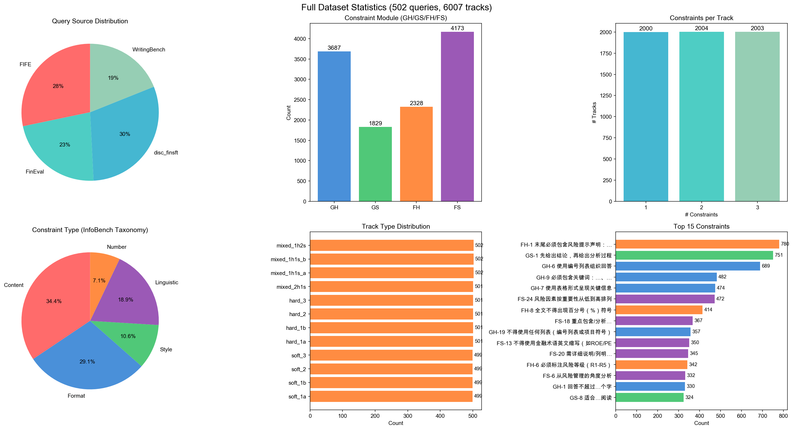

# 周报：中文金融指令遵循 Benchmark 建设

> 日期：2026-04-11 | 项目阶段：Phase 3 数据生成与评分

## 一、本周摘要

- ✅ **约束池优化**：调整为 60 条（3 条 ID 重映射 + 1 条新增 + 约束文本精化），消除 hard/soft 错分问题
- ✅ **项目大整理**：清理 94 个旧文件（减少 40% 体积），创建 AGENT.md 导引，重写 memory 文件
- ✅ **Track v2 全量生成**：6,007 条 track，12 种 type，约束数量 1:2:3 完美均匀分布，60/60 约束全覆盖
- ✅ **多模型 Response 生成**：GPT-5 / 5.1 / 5.2 各 600 条 test response（GPT-5.4 跑中）
- ✅ **Hard 评分 + 9 个 Checker 修复**：从初始 79% 逐步提升到 94-96%，消除所有 checker error
- 🔴 **Soft 评分**：Minimax 代理不可用，待恢复后断点续跑

---

## 二、约束池优化（59 → 60 条）

针对 review 中发现的 hard/soft 错分和约束文本不精确问题，进行了以下调整：

| 变更 | 旧 | 新 | 原因 |
|------|-----|-----|------|
| FH-4 → FS-12 | 按排序输出（hard, regex） | 按排序输出（soft, LLM judge） | 语义排序无法用 regex 验证 |
| FH-10 → FS-13 | 禁英文缩写（hard, regex） | 禁英文缩写（soft, LLM judge） | 需区分金融缩写和通用缩写 |
| 新 FH-4 | （空位） | 数值数据统一保留{N}位小数 | 新增可 regex 验证的金融约束 |
| FH-4 文本精化 | "所有数字保留{N}位小数" | "回答中的数值数据统一保留{N}位小数" | 避免年份/编号被误判 |

---

## 三、Track v2 全量生成

### 3.1 方案设计

核心改进：从旧方案（9 种 type，约束分布不均 2:3:4）改为新方案（12 种 type，约束分布 4:4:4 完美均匀）。

| 类别 | Type | 约束构成 | 条数/query |
|------|------|---------|-----------|
| Hard | hard_1a / hard_1b | 1 Hard | 2 |
| Hard | hard_2 | 2 Hard | 1 |
| Hard | hard_3 | 3 Hard | 1 |
| Soft | soft_1a / soft_1b | 1 Soft | 2 |
| Soft | soft_2 | 2 Soft | 1 |
| Soft | soft_3 | 3 Soft | 1 |
| Mixed | mixed_1h1s_a / mixed_1h1s_b | 1H + 1S | 2 |
| Mixed | mixed_1h2s | 1H + 2S | 1 |
| Mixed | mixed_2h1s | 2H + 1S | 1 |

### 3.2 生成策略

采用 3 个独立 System Prompt 分批生成，每批 4 条 track：

- **SP-Hard**：只列 28 条 Hard 约束 → 生成 hard_1a/1b/2/3
- **SP-Soft**：只列 32 条 Soft 约束 → 生成 soft_1a/1b/2/3
- **SP-Mixed**：列全部 60 条约束 → 生成 mixed_1h1s_a/b, 1h2s, 2h1s

每 query 3 次 Vulcan 调用（GPT-5），502 queries × 3 = 1,506 次调用，总计生成 6,007 条有效 track。

### 3.3 数据统计

> **关键指标**：约束数量分布 1:2:3 = 2000:2004:2003（完美 33.3%:33.4%:33.3%）；约束覆盖 60/60（100%）；反直觉约束被自然选用（FS-24: 472次, FH-8: 414次, GH-19: 357次）

### 3.4 Train/Test 切分

| | Queries | Tracks |
|---|---------|--------|
| Train | 452 | 5,407 |
| Test | 50 | 600 |
| Total | 502 | 6,007 |

Query 零重叠，按来源（FinEval/FIFE/DISC/WritingBench）分层采样。

---

## 四、多模型评测

### 4.1 模型输出长度对比

| 模型 | 平均长度 | 中位数 | 相对 GPT-5 |
|------|---------|--------|-----------|
| GPT-5 | 2,098 字 | 1,562 字 | 1.00x |
| GPT-5.1 | 3,122 字 | 2,612 字 | 1.64x |
| GPT-5.2 | 2,015 字 | 1,472 字 | 1.09x |

GPT-5.1 平均比 GPT-5 长 64%，倾向更详细的回答。

### 4.2 Hard 评分结果

| 模型 | Hard Pass | Hard Rate |
|------|-----------|-----------|
| GPT-5 | 578 / 600 | **96.3%** |
| GPT-5.1 | 568 / 600 | 94.7% |
| GPT-5.2 | 575 / 600 | 95.8% |

### 4.3 Soft 评分

🔴 Minimax GPT-5 代理（thirdpart-proxy-prod.xaminim.com）连接超时，soft 评分暂停。代理恢复后支持断点续跑。

---

## 五、Checker 修复（9 处）

通过 review 前端逐条检查 hard fail 数据，发现并修复了 9 个 checker bug：

| Checker | 问题 | 修复方式 |
|---------|------|---------|
| GH-3 | 称呼行"尊敬的XX："被算作段落 | 跳过开头的称呼/问候行 |
| GH-5 | 只识别 # 标题，不识别中文编号（一、/1.1/1.1.1） | 正则加入中文层级编号识别 |
| GH-6 | 编号列表只匹配 `1.` 格式 | 扩展支持 `1)`/`1）`/`1、`/`（1）` |
| GH-7 | 表格分隔符要求 ≥3 个 `-` | 放宽为 ≥1 个 `-` |
| GH-10 | 参数名 `word` 与 track 数据的 `forbidden_word` 不匹配 | 兼容两个 key 名 |
| GH-11 | 首词提取贪婪匹配 8 汉字 | 改为 startswith 判断 |
| FH-4 | 年份/时间/编号/品牌名/量词被误判 | 加入 6 类排除规则 |
| FH-5 | ISO 4217 示例含多币种导致互斥判定必 fail | 区分 ISO 格式检查和单币种排他检查 |
| ref_local_gpt.py | requests 超时时 response 未赋值导致 NameError | try/except NameError 保护 |

> **修复效果**：Hard pass rate 从初始 79-86% 提升到 94-96%。Checker error 从数百条降为 0。

---

## 六、项目整理

- **清理旧文件**：删除 94 个旧文件（旧 track/score/script/viewer），项目体积减少 40%
- **创建 AGENT.md**：AI agent 导引文件，含目录结构、数据索引、约束完整列表、评分命令
- **更新 memory**：project_overview.md / progress.md / literature_and_benchmarks.md / README.md 全部重写
- **重命名数据文件**：tracks.jsonl → all_tracks.jsonl 等，文件名更清晰
- **README.md 重写**：从旧 550q/5500t 更新为当前状态

---

## 七、下周计划

| 优先级 | 任务 | 状态 |
|--------|------|------|
| 高 | 代理恢复后完成 Soft 评分（3 模型 × 600 条） | 🔴 阻塞 |
| 高 | GPT-5.4 response 到位后跑评分 | ⚙️ 进行中 |
| 高 | 出 4 模型完整对比报告 | 待 Soft 完成 |
| 高 | 用强模型对 5,407 条 train track 生成 gold response | 待启动 |
| 中 | SFT 微调 8B 模型 | 待启动 |
| 中 | 补充开源模型基线（Qwen3-8B / Qwen2.5-7B 等） | 待启动 |
